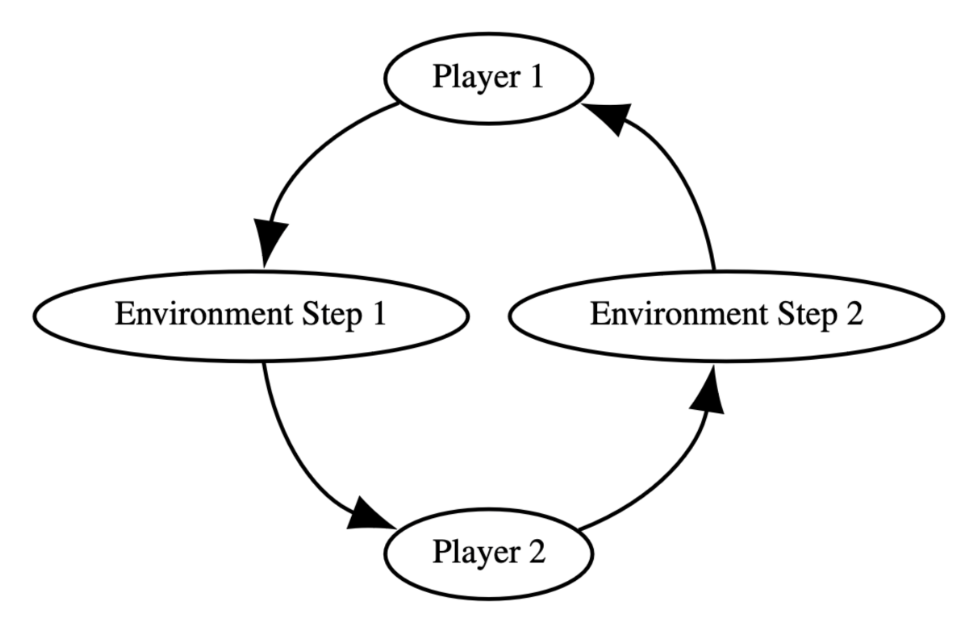

多智能体强化学习环境该如何搭建呢？
如何训练这个环境呢？

# Pettingzoo
Pettingzoo提供了很多预设的工具接口，方便快速搭建一个自定义的多智能体强化学习环境，例如：utils、wrapper等。

Pettingzoo具有两种环境基类（AEC 和 ParallelEnv）。AEC for Agent Environment Cycle，ParallelEnv for Parallel Environment。


AEC的环境如图所示，每一个agent都可以观察到别的智能体动作后的环境，当然，这种环境的搭建难度会更复杂一些。ParallelEnv环境则比较简单，所有的agent同时观察上一时刻的环境，但是agent之间没有交互。

下面是ParallelEnv的源码实现，并且提供了精确的注释释义，自定义需要override这个类中的reset、step、render、close、state、observation_space、action_space方法。
```python
class ParallelEnv(Generic[AgentID, ObsType, ActionType]):
    """Parallel environment class.

    It steps every live agent at once. If you are unsure if you
    have implemented a ParallelEnv correctly, try running the `parallel_api_test` in
    the Developer documentation on the website.
    """

    # metadata是一个类变量dict，一般包括环境名称（env_v0）的键值对name，
    # 以及render_modes，一般包括'human'、'rgb_array'、'ansi'
    metadata: dict[str, Any]
    # agents是一个list，里面是agent的id
    agents: list[AgentID]
    # possible_agents是一个list，里面是所有agent的名字
    possible_agents: list[AgentID]
    # observation_spaces是一个dict，由agent的id和agent的observation_space组成
    observation_spaces: dict[
        AgentID, gymnasium.spaces.Space
    ]  # Observation space for each agent
    # action_spaces是一个dict，由agent的id和agent的action_space组成
    action_spaces: dict[AgentID, gymnasium.spaces.Space]
    # reset是实例方法需要override，返回一个tuple，第一个元素是所有agent的observation_spaces，第二个元素是所有agent的info，均以字典形式返回
    def reset(
        self,
        seed: int | None = None,
        options: dict | None = None,
    ) -> tuple[dict[AgentID, ObsType], dict[AgentID, dict]]:
        """Resets the environment.

        And returns a dictionary of observations (keyed by the agent name)
        """
        raise NotImplementedError
    # step是每一个时间步执行的部分，也是实例方法需要override，返回一个tuple，第一个元素是所有agent的observation_spaces，第二个元素是所有agent的reward，第三个元素是所有agent的terminated，第四个元素是所有agent的truncated，第五个元素是所有agent的info，均以字典形式返回
    def step(
        self, actions: dict[AgentID, ActionType]
    ) -> tuple[
        dict[AgentID, ObsType],
        dict[AgentID, float],
        dict[AgentID, bool],
        dict[AgentID, bool],
        dict[AgentID, dict],
    ]:
        """Receives a dictionary of actions keyed by the agent name.

        Returns the observation dictionary, reward dictionary, terminated dictionary, truncated dictionary
        and info dictionary, where each dictionary is keyed by the agent.
        """
        raise NotImplementedError
    # render是渲染环境，也是实例方法需要override，返回一个None或者numpy数组或者字符串或者list，一般会用到pygame来实现环境的可视化，或者直接在终端打印，在这里会用到render_mode来判断渲染的方式
    def render(self) -> None | np.ndarray | str | list:
        """Displays a rendered frame from the environment, if supported.

        Alternate render modes in the default environments are `'rgb_array'`
        which returns a numpy array and is supported by all environments outside
        of classic, and `'ansi'` which returns the strings printed
        (specific to classic environments).
        """
        raise NotImplementedError
    # close是关闭渲染窗口，如果用到pygame，需要调用pygame.quit()来关闭窗口。若未用到则不需要override
    def close(self):
        """Closes the rendering window."""
        pass
    # 若state方法未在环境中被实现，则会报错，报错内容用到metadata中的name键对应的环境名称
    def state(self) -> np.ndarray:
        """Returns the state.

        State returns a global view of the environment appropriate for
        centralized training decentralized execution methods like QMIX
        """
        raise NotImplementedError(
            "state() method has not been implemented in the environment {}.".format(
                self.metadata.get("name", self.__class__.__name__)
            )
        )
    # observvation_space方法需要被重写，否则会报警告，其作用是返回agent的id对应的观察空间
    def observation_space(self, agent: AgentID) -> gymnasium.spaces.Space:
        """Takes in agent and returns the observation space for that agent.

        MUST return the same value for the same agent name

        Default implementation is to return the observation_spaces dict
        """
        warnings.warn(
            "Your environment should override the observation_space function. Attempting to use the observation_spaces dict attribute."
        )
        return self.observation_spaces[agent]
    # action_space方法需要被重写，否则会报警告，其作用是返回agent的id对应的动作空间
    def action_space(self, agent: AgentID) -> gymnasium.spaces.Space:
        """Takes in agent and returns the action space for that agent.

        MUST return the same value for the same agent name

        Default implementation is to return the action_spaces dict
        """
        warnings.warn(
            "Your environment should override the action_space function. Attempting to use the action_spaces dict attribute."
        )
        return self.action_spaces[agent]
    # num_agents属性返回agent的数量
    @property
    def num_agents(self) -> int:
        return len(self.agents)
    # max_num_agents属性返回所有agent的数量
    @property
    def max_num_agents(self) -> int:
        return len(self.possible_agents)
    # __str__方法返回环境名称
    def __str__(self) -> str:
        """Returns the name.

        Which looks like: "space_invaders_v1" by default
        """
        if hasattr(self, "metadata"):
            return self.metadata.get("name", self.__class__.__name__)
        else:
            return self.__class__.__name__
    # unwrapped属性返回环境实例本身
    @property
    def unwrapped(self) -> ParallelEnv:
        return self

```